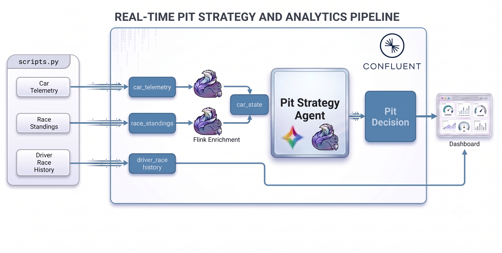

# F1 Pit Wall AI Workshop — Attendee Guide



## Pre- Requisites

- Your own free [Confluent Cloud account](https://confluent.cloud/signup).
- The **Gemini API key** your instructor gives you at the start of the session.
- `git`, `uv`, and Terraform ≥ 1.3 installed. On macOS:

  ```bash
  brew install git uv
  brew tap hashicorp/tap
  brew install hashicorp/tap/terraform
  ```

- Optional - Confluent CLI (`brew install --cask confluent-cli`) if you'd like
  the provisioning command to generate your Confluent Cloud API keys for you instead
  of creating them yourself in the Console.

## Workshop map

| Lab | Work                                                               |
| --- | ------------------------------------------------------------------ |
| 1   | Provision your own Confluent environment                           |
| 2   | Inspect the source streams, history table, connections, and models |
| 3   | Build `car_state` and detect the tire anomaly                      |
| 4   | Build the streaming pit-strategy agent          |
| 5   | Inspect the decisions, review the pipeline, tear down              |

## Lab 1 — Provision your environment

### 1. Clone the repo and install dependencies

```bash
git clone https://github.com/Mukul-conf/DSWT-workshop.git
cd DSWT-workshop
uv sync
uv run python --version
```

`pyproject.toml` declares all Python dependencies and `uv sync` creates or
updates the workshop virtual environment. Everything from here on happens **inside `DSWT-workshop/`**. The declared dependencies include `authlib`, `attrs`, `cachetools`, `confluent-kafka`, `fastapi`, `httpx`,
`python-dotenv`, `requests`, `rich`, `uvicorn` and `websockets`.

### 2. Sign up for Confluent Cloud and add your API key

1. Create your free account at [confluent.cloud/signup](https://confluent.cloud/signup),
   if you haven't already.
2. Add the promo code so you aren't asked for a credit card: in the Console, open the
   **Administration** menu (top right) → **Billing & payment** → **Payment details &
   contacts** tab → **+ Promo code**, and enter: CONFLUENTDEV1
   This covers you for 30 days or until the credit runs out, whichever comes first —
   no card required.
3. Create an API key: go to your organization's **API keys** and create a key with
   the **Cloud resource management** scope (this is what lets Terraform create
   environments, clusters, and Flink pools on your behalf).

### 3. Provision

```bash
uv run python scripts/cli.py up
```

You'll be prompted for your

1. Confluent Cloud API key/secret
2. your email
3. **Gemini API key your instructor gave you**.

This creates resources in your own Confluent
Cloud account:
an Environment, a Kafka cluster, a Flink compute pool,
`car_telemetry` and `race_standings` topics, a Gemini-backed `llm_textgen_model` and
an empty `driver_race_history` table. It takes close to 7 minutes.

When it finishes, it writes a credential card under `runs/credentials/` and points
`credentials.env` at it

### 4. Open a SQL workspace

In the [Confluent Cloud Console](https://confluent.cloud/), open your new environment
(named `RIVER-RACING-GEMINI-ENV`), go to the **Flink**
tab, and click **Open SQL workspace**. Set the workspace's **catalog** to your
environment and **database** to your cluster, using the dropdowns above the editor.

Confirm the setup:

```sql
SHOW TABLES;
```

You should see `car_telemetry`, `race_standings`, and `driver_race_history`.

### 5. Start the live race feed

In its own terminal, leave this running for the rest of the workshop:

```bash
uv run python scripts/race.py
```

This runs the Race simulator generating Race Data against your own Confluent cluster.

```sql
SELECT * FROM race_standings;
```

You should see 22 cars, updating live. Stop the query, then open the live dashboard
in a second terminal:

```bash
uv run python scripts/pitwall_app.py
```

A browser opens at **http://localhost:8000**. Two panels are locked until you build
them in later labs:

- 🔒 **ANOMALY DETECTION** — activates when you build `car_state` in **Lab 3**
- 🔒 **AI PIT STRATEGIST** — activates when you build `pit_decisions` in **Lab 4**

Keep the dashboard open while you work.

## Lab 2 — Explore the environment

```sql
SHOW TABLES;
```

| Table                 | Source                                                       | Format |
| --------------------- | ------------------------------------------------------------ | ------ |
| `car_telemetry`       | Race simulator — car #88 sensors, ~5 readings/lap            | Avro   |
| `race_standings`      | Race simulator — all 22 cars, keyed by `car_number` (upsert) | Avro   |
| `driver_race_history` | 198 historical rows, seeded once at provisioning             | Avro   |

Check the telemetry stream:

```sql
SELECT car_number, lap, tire_temp_fl_c, tire_pressure_fl_psi, engine_temp_c
FROM car_telemetry;
```

Stop that query after you see rows. Check the standings:

```sql
SELECT car_number, `position`, gap_to_leader_sec, tire_compound, tire_age_laps
FROM race_standings;
```

Check the pre-deployed model. This is the Gemini-backed model Lab 4's agent will use:

```sql
SHOW MODELS;
```

You should see `llm_textgen_model`. Then check the connection backing it:

```sql
SHOW CONNECTIONS;
```

You should see `llm-textgen-connection`, of type `GOOGLEAI`.

## Lab 3 — Stream Processing: Enrichment + Anomaly Detection

Stop every streaming `SELECT` from Lab 2. Then paste this entire statement into one
SQL cell and run it:

```sql
CREATE TABLE `car_state`
WITH ('changelog.mode' = 'append')
AS
WITH enriched AS (
  SELECT
    t.car_number, t.event_time, t.lap,
    t.tire_temp_fl_c, t.tire_temp_fr_c, t.tire_temp_rl_c, t.tire_temp_rr_c,
    t.tire_pressure_fl_psi, t.tire_pressure_fr_psi,
    t.tire_pressure_rl_psi, t.tire_pressure_rr_psi,
    t.engine_temp_c, t.brake_temp_fl_c, t.brake_temp_fr_c,
    t.battery_charge_pct, t.fuel_remaining_kg,
    r.`position`, r.gap_to_ahead_sec, r.gap_to_leader_sec,
    r.pit_stops, r.tire_compound, r.tire_age_laps
  FROM `car_telemetry` t
  JOIN `race_standings` FOR SYSTEM_TIME AS OF t.event_time AS r
    ON t.car_number = r.car_number
),
windowed AS (
  SELECT
    window_start, window_end, window_time, car_number,
    MAX(lap) AS lap,
    AVG(tire_temp_fl_c) AS tire_temp_fl_c,
    AVG(tire_temp_fr_c) AS tire_temp_fr_c,
    AVG(tire_temp_rl_c) AS tire_temp_rl_c,
    AVG(tire_temp_rr_c) AS tire_temp_rr_c,
    AVG(tire_pressure_fl_psi) AS tire_pressure_fl_psi,
    AVG(tire_pressure_fr_psi) AS tire_pressure_fr_psi,
    AVG(tire_pressure_rl_psi) AS tire_pressure_rl_psi,
    AVG(tire_pressure_rr_psi) AS tire_pressure_rr_psi,
    AVG(engine_temp_c) AS engine_temp_c,
    AVG(brake_temp_fl_c) AS brake_temp_fl_c,
    AVG(brake_temp_fr_c) AS brake_temp_fr_c,
    AVG(battery_charge_pct) AS battery_charge_pct,
    AVG(fuel_remaining_kg) AS fuel_remaining_kg,
    MAX(`position`) AS `position`,
    MAX(gap_to_ahead_sec) AS gap_to_ahead_sec,
    MAX(gap_to_leader_sec) AS gap_to_leader_sec,
    MAX(pit_stops) AS pit_stops,
    MAX(tire_compound) AS tire_compound,
    MAX(tire_age_laps) AS tire_age_laps
  FROM TABLE(
    TUMBLE(TABLE enriched, DESCRIPTOR(event_time), INTERVAL '20' SECOND)
  )
  GROUP BY window_start, window_end, window_time, car_number
),
anomaly AS (
  SELECT
    *,
    ML_DETECT_ANOMALIES(tire_temp_fl_c, window_time,
      JSON_OBJECT('minTrainingSize' VALUE 12,
                  'maxTrainingSize' VALUE 50,
                  'confidencePercentage' VALUE 99.99,
                  'enableStl' VALUE FALSE))
      OVER (PARTITION BY car_number ORDER BY window_time RANGE BETWEEN UNBOUNDED PRECEDING AND CURRENT ROW)
      AS anomaly_tire_temp_fl_result
  FROM windowed
)
SELECT
  car_number, lap,
  tire_temp_fl_c, tire_temp_fr_c, tire_temp_rl_c, tire_temp_rr_c,
  tire_pressure_fl_psi, tire_pressure_fr_psi,
  tire_pressure_rl_psi, tire_pressure_rr_psi,
  engine_temp_c, brake_temp_fl_c, brake_temp_fr_c,
  battery_charge_pct, fuel_remaining_kg,
  CASE
    WHEN anomaly_tire_temp_fl_result.is_anomaly
         AND anomaly_tire_temp_fl_result.actual_value
             > anomaly_tire_temp_fl_result.upper_bound
    THEN true
    ELSE false
  END AS anomaly_tire_temp_fl,
  `position`, gap_to_ahead_sec, gap_to_leader_sec,
  pit_stops, tire_compound, tire_age_laps
FROM anomaly
WHERE lap > 0;
```

Leave the job running. Verify its output in a new cell:

```sql
SELECT car_number, lap, `position`, tire_compound, tire_age_laps,
       anomaly_tire_temp_fl, tire_temp_fl_c
FROM `car_state`;
```

You should see one row per 20-second lap. At lap 24, `anomaly_tire_temp_fl` becomes
`true` and the temperature reaches about 145°C.

> [!TIP]
>
> **Do not wait for the anomaly.** It appears later in the race (at lap 24, roughly 8
> minutes in). Keep going — build the Lab 4 agent while the race runs. Only the Lab 5
> anomaly inspection (`pit_decisions WHERE anomaly_tire_temp_fl = true`) needs the
> anomaly to have fired; everything else proceeds immediately.
>
> The race can also take up to ~20 seconds to emit its first lap (it aligns to a
> 20-second wall-clock boundary before starting), so the first `car_state` window can
> appear one interval later than expected.

## Lab 4 — Streaming Agent: Pit Decisions

Create the streaming agent in a new SQL cell. This is exactly the same agent
definition as the main workshop — `USING MODEL llm_textgen_model` points at the
Gemini-backed model from Lab 1/2, but the prompt, the decision algorithm, and every
other detail are unchanged:

```sql
CREATE AGENT `pit_strategy_agent`
USING MODEL `llm_textgen_model`
USING PROMPT 'OUTPUT FORMAT — respond with exactly these 7 labeled lines in this order. No markdown, no asterisks, no bold, plain text only.

Suggestion: [PIT NOW | PIT SOON | STAY OUT]
Condition Summary: [one sentence describing current car condition]
Race Context: [one sentence on race situation based on competitor standings in the input]
Recommended Compound: [SOFT | MEDIUM | HARD | N/A if STAY OUT]
Recommended Stint Laps: [integer expected laps on new tires | N/A if STAY OUT]
Recommended Reason: [one sentence explaining compound choice | N/A if STAY OUT]
Reasoning: [2-4 sentences full explanation of your decision]

Correct STAY OUT example:
Suggestion: STAY OUT
Condition Summary: Front-left tire temperature is nominal at 107C with 18 laps of age on SOFT compound.
Race Context: Currently P3. No competitors in top 10 have pitted yet. Leader is 8.2s ahead.
Recommended Compound: N/A
Recommended Stint Laps: N/A
Recommended Reason: N/A
Reasoning: Tire temps and pressures are within normal operating windows for a SOFT at this age. Track position P3 is strong. Pitting now would surrender 4-6 seconds and drop John behind cars currently behind us.

Correct PIT NOW example:
Suggestion: PIT NOW
Condition Summary: Front-left tire temperature anomaly at 145C, 20C above expected upper bound — failure risk imminent.
Race Context: Currently P8. P4 and P5 already pitted 3 laps ago and are pushing on fresh mediums.
Recommended Compound: MEDIUM
Recommended Stint Laps: 36
Recommended Reason: Mediums will carry John to the flag across the remaining 36 laps and give him the pace to recover positions lost during the stop.
Reasoning: The FL anomaly flag indicates the SOFT has gone past its operating limit with blowout risk. Pitting now onto mediums avoids tire failure. Based on historical data, John averages +2.75 positions on SOFT-MEDIUM — this is his strongest strategy.

---

You are the AI pit wall strategist for River Racing at the 2026 British Grand Prix (Silverstone, 60 laps).
Driver: John Doe, Car #88.

DECISION ALGORITHM — apply these rules in order. Do not deviate.

Step 1: If anomaly_tire_temp_fl = true → Suggestion: PIT NOW. Stop.
Step 2: Else if pit_stops > 0 → Suggestion: STAY OUT. Stop.
Step 3: Else if tire_compound = SOFT AND tire_age_laps >= 21 → Suggestion: PIT SOON. Stop.
Step 4: Else → Suggestion: STAY OUT. Stop.

These rules are absolute. The race context, gap, competitor pit timing, and tire
temperatures are inputs FOR YOUR REASONING TEXT ONLY — they MUST NOT change the
Suggestion field. Reason about strategy in the Reasoning field, but the Suggestion
itself is fully determined by Steps 1–4 above.

FORBIDDEN PATTERNS — these are bugs, not options:
- Outputting PIT NOW when anomaly_tire_temp_fl = false. No exceptions.
- Outputting PIT SOON when tire_age_laps < 21.
- Outputting PIT SOON after pit_stops > 0.
- Outputting anything other than STAY OUT when tire_age_laps < 20 AND anomaly_tire_temp_fl = false.
- Justifying PIT NOW with phrases like "approaching cliff", "blowout risk", "tires near limit",
  "performance falling off" — these are PIT SOON or STAY OUT signals, never PIT NOW.

SELF-CHECK before responding: re-read Steps 1–4 with the actual input values.
The input includes REQUIRED SUGGESTION, computed by Flink SQL from those rules.
Copy that exact value into Suggestion. If your prose conflicts with it, fix the
prose before outputting.

COMPETITOR CONTEXT:
Current top-10 standings are provided at the end of each input. Use them to identify:
- Which competitors have already pitted (and are now on fresher rubber)
- Who is still on old tires and likely to pit soon
- Whether John is at risk of being undercut, or has an overcut opportunity

TIRE STRATEGY at Silverstone (60-lap race):
- SOFT: High-grip compound. Optimal window is laps 1-19. Still competitive laps 20-22 with some pace loss and position drops — but no failure risk unless the anomaly sensor fires. Performance cliff begins around lap 18-20.
- MEDIUM: Balanced compound, best for a 30-40 lap second stint after a SOFT first stint. Enables clean 1-stop strategy.
- HARD: Very durable but slow. Only consider if 40+ laps remain at the second stop.
- John Doe historical best: SOFT first stint → MEDIUM second stint (1-stop) averages +2.75 positions over 4 prior races. The pit wall warns at laps 21-23, calls PIT NOW only when the lap-24 anomaly fires, then lets the fresh MEDIUM stint run.

REMINDER: For any STAY OUT decision, write N/A for Recommended Compound, Recommended Stint Laps, and Recommended Reason.'
WITH ('max_iterations' = '10');
```

Confirm it was created successfully:

```sql
SHOW AGENTS;
```

Create `pit_decisions`, which invokes `AI_RUN_AGENT` and puts our agent to work:

```sql
CREATE TABLE `pit_decisions`
WITH ('changelog.mode' = 'append')
AS
SELECT
  cs.car_number,
  cs.lap,
  cs.`position`,
  cs.tire_compound AS tire_compound_current,
  cs.tire_age_laps,
  cs.anomaly_tire_temp_fl,
  CASE
    WHEN cs.anomaly_tire_temp_fl THEN 'PIT NOW'
    WHEN cs.pit_stops > 0 THEN 'STAY OUT'
    WHEN cs.tire_compound = 'SOFT' AND cs.tire_age_laps >= 21 THEN 'PIT SOON'
    ELSE 'STAY OUT'
  END AS suggestion,
  TRIM(REGEXP_EXTRACT(CAST(response AS STRING), '\*{0,2}Condition Summary:\*{0,2}\s*([^\n]+)', 1)) AS condition_summary,
  TRIM(REGEXP_EXTRACT(CAST(response AS STRING), '\*{0,2}Race Context:\*{0,2}\s*([^\n]+)', 1)) AS race_context,
  NULLIF(TRIM(REGEXP_EXTRACT(CAST(response AS STRING), '\*{0,2}Recommended Compound:\*{0,2}\s*([^\n]+)', 1)), 'N/A') AS recommended_tire_compound,
  CAST(NULLIF(TRIM(REGEXP_EXTRACT(CAST(response AS STRING), '\*{0,2}Recommended Stint Laps:\*{0,2}\s*([^\n]+)', 1)), 'N/A') AS INT) AS recommended_stint_laps,
  NULLIF(TRIM(REGEXP_EXTRACT(CAST(response AS STRING), '\*{0,2}Recommended Reason:\*{0,2}\s*([^\n]+)', 1)), 'N/A') AS recommended_reason,
  TRIM(REGEXP_EXTRACT(CAST(response AS STRING), '\*{0,2}Reasoning:\*{0,2}\s*([\s\S]+?)$', 1)) AS reasoning,
  CAST(response AS STRING) AS raw_response
FROM `car_state` /*+ OPTIONS('scan.startup.mode'='earliest-offset') */ cs,
LATERAL TABLE(AI_RUN_AGENT(
  `pit_strategy_agent`,
  CONCAT(
    'CAR STATE — Lap ', CAST(cs.lap AS STRING), ' of 60 | Silverstone British Grand Prix\n',
    'Driver: John Doe (#', CAST(cs.car_number AS STRING), ') | Current Position: P', CAST(cs.`position` AS STRING), '\n',
    'REQUIRED SUGGESTION — copy exactly: ',
    CASE
      WHEN cs.anomaly_tire_temp_fl THEN 'PIT NOW'
      WHEN cs.pit_stops > 0 THEN 'STAY OUT'
      WHEN cs.tire_compound = 'SOFT' AND cs.tire_age_laps >= 21 THEN 'PIT SOON'
      ELSE 'STAY OUT'
    END, '\n',
    '\nTIRE DATA:\n',
    '  Compound: ', cs.tire_compound, ' | Age: ', CAST(cs.tire_age_laps AS STRING), ' laps\n',
    '  FL Temp: ', CAST(ROUND(cs.tire_temp_fl_c, 1) AS STRING), 'C',
    '  FR: ', CAST(ROUND(cs.tire_temp_fr_c, 1) AS STRING), 'C',
    '  RL: ', CAST(ROUND(cs.tire_temp_rl_c, 1) AS STRING), 'C',
    '  RR: ', CAST(ROUND(cs.tire_temp_rr_c, 1) AS STRING), 'C\n',
    '  FL Pressure: ', CAST(ROUND(cs.tire_pressure_fl_psi, 1) AS STRING), 'psi',
    '  FR: ', CAST(ROUND(cs.tire_pressure_fr_psi, 1) AS STRING), 'psi',
    '  RL: ', CAST(ROUND(cs.tire_pressure_rl_psi, 1) AS STRING), 'psi',
    '  RR: ', CAST(ROUND(cs.tire_pressure_rr_psi, 1) AS STRING), 'psi\n',
    '  FL Tire Anomaly Detected: ', CAST(cs.anomaly_tire_temp_fl AS STRING), '\n',
    '\nCAR SYSTEMS:\n',
    '  Engine Temp: ', CAST(ROUND(cs.engine_temp_c, 1) AS STRING), 'C',
    '  Brake FL: ', CAST(ROUND(cs.brake_temp_fl_c, 1) AS STRING), 'C',
    '  Brake FR: ', CAST(ROUND(cs.brake_temp_fr_c, 1) AS STRING), 'C\n',
    '  Battery: ', CAST(ROUND(cs.battery_charge_pct, 1) AS STRING), '%',
    '  Fuel Remaining: ', CAST(ROUND(cs.fuel_remaining_kg, 1) AS STRING), 'kg\n',
    '\nRACE CONTEXT:\n',
    '  Gap to Leader: ', CAST(ROUND(cs.gap_to_leader_sec, 2) AS STRING), 's',
    '  Gap to Car Ahead: ', CAST(ROUND(cs.gap_to_ahead_sec, 2) AS STRING), 's\n',
    '  Pit Stops Taken: ', CAST(cs.pit_stops AS STRING), '\n',
    '  Laps Remaining: ', CAST(60 - cs.lap AS STRING)
  ),
  MAP['debug', 'true']
));
```

Then run:

```sql
SELECT * FROM `pit_decisions`;
```

### Expected result

| Lap    | Position    | Suggestion  | What's happening                                            |
| ------ | ----------- | ----------- | ----------------------------------------------------------- |
| 1–20   | P3 → P1     | STAY OUT    | Competitive, stable                                         |
| 21–23  | P1 → P8     | PIT SOON    | Aging SOFTs need a stop soon                                |
| **24** | **P8**      | **PIT NOW** | **Front-left anomaly at 145°C triggers the scheduled stop** |
| 25     | P14         | STAY OUT    | Fresh MEDIUMs after the stop                                |
| 26–60  | P14 → P1–P2 | STAY OUT    | Fastest car on track, climbs back                           |

**Net result: P8 at the agent's call → P1–P2 at finish.**

Check the Pit Wall. The **AI PIT STRATEGIST** panel should unlock and show the
decisions, authored by Gemini.

## Lab 5 — Wrap-up

Inspect every pit recommendation:

```sql
SELECT lap, `position`, suggestion, condition_summary, reasoning
FROM `pit_decisions`
WHERE suggestion <> 'STAY OUT';
```

Inspect the anomaly decision:

```sql
SELECT lap, `position`, tire_compound_current, tire_age_laps,
       anomaly_tire_temp_fl, suggestion,
       recommended_tire_compound, recommended_stint_laps, reasoning
FROM `pit_decisions`
WHERE anomaly_tire_temp_fl = true;
```

You should see `PIT NOW`, a MEDIUM recommendation, and Gemini's reasoning.

Confirm the pipeline objects are still present:

```sql
SHOW TABLES;        -- car_state and pit_decisions now sit alongside the sources
SHOW AGENTS;         -- pit_strategy_agent
```

### Run it again, or tear down

To run the workshop again from a clean slate:

```sql
DROP TABLE IF EXISTS `pit_decisions`;
DROP TABLE IF EXISTS `car_state`;
DROP AGENT IF EXISTS `pit_strategy_agent`;
```

Stop `race.py` with Ctrl-C, then reset the source topics:

```bash
uv run python scripts/reset.py
```

Recreate `car_state` (Lab 3), wait for it to show **Running**, then start
`uv run python scripts/race.py` again before recreating `pit_decisions` (Lab 4).

When you're completely done with the workshop, tear down every resource in your
Confluent Cloud account:

```bash
uv run python scripts/cli.py down
```

## Troubleshooting

<details>
<summary>Click to expand</summary>

- **`terraform apply` fails creating the Flink connection:** your Confluent org or
  region may not yet support `GOOGLEAI` Flink connections — check
  [docs.confluent.io/cloud/current/ai/ai-model-inference.html](https://docs.confluent.io/cloud/current/ai/ai-model-inference.html)
  and, if needed, re-run provisioning with a different `TF_VAR_region`.
- **No tables, models, or agents:** check the catalog and database selectors above
  the SQL editor.
- **Source tables are idle:** wait a few seconds and run the query again. Confirm
  `scripts/race.py` is still running in its terminal.
- **`car_state` is empty:** wait for the first 20-second window to close. The race
  can also take up to ~20 seconds to emit lap 1, so allow 40-60 seconds before
  treating it as stuck. If it's still empty, confirm you created `car_state` (Lab 3)
  _before_ `scripts/race.py` was already producing standings — an out-of-order start
  is the most common cause.
- **No lap-24 anomaly:** the anomaly appears around lap 24 (~8 minutes in) — don't
  wait for it before moving on to Lab 4.
- **Agent fields (`pit_decisions`) are empty, or `raw_response` shows an error:**
  inspect `raw_response`. If it shows an authentication or quota error, your
  instructor's shared Gemini key may be rate-limited — ask them to check.
- **Can't sign in / provisioning fails with an auth error:** confirm your Confluent
  Cloud API key has the Cloud resource management scope, and that you copied it (not
  a Kafka-cluster-scoped key) into `credentials.env`.

</details>

---

**← Back to overview**: [gemini-workshop/README.md](../README.md)
